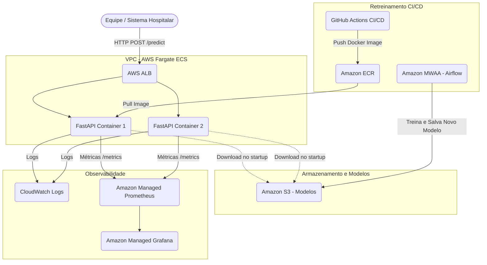

# ADR 001: Estratégia de Deploy em Produção (AWS)

## Contexto
Um hospital de referência precisa de um sistema de triagem automática de exames de texto (laudos médicos) para classificar o nível de urgência (normal, atenção, urgente). O modelo de Machine Learning (NLP) é servido via uma API REST desenvolvida com FastAPI e conteinerizada utilizando Docker.
Este documento avalia a estratégia recomendada de deploy na nuvem, considerando requisitos de latência, escalabilidade, observabilidade e retreinamento.

## Comparação: Batch vs. Inferência em Tempo Real

| Característica | Processamento Batch | Inferência em Tempo Real (Real-time) |
| --- | --- | --- |
| **Latência** | Alta (minutos a horas). Os laudos são acumulados e processados juntos. | Baixa (milissegundos). Cada laudo é processado assim que recebido. |
| **Impacto no Negócio** | Inadequado para o caso de uso. Atrasar a detecção de um exame "Urgente" pode ser fatal. | Ideal. O paciente e a equipe médica recebem a priorização imediatamente. |
| **Custo de Infraestrutura** | Menor. Recursos podem ser ligados apenas durante o processamento. | Maior. A API precisa estar sempre disponível aguardando requisições (always-on). |
| **Complexidade** | Moderada. Requer orquestradores de job robustos. | Moderada. Requer alta disponibilidade, balanceamento de carga e auto-scaling. |

## Decisão

**Estratégia Escolhida:** Inferência em Tempo Real (Real-time).
**Justificativa:** O sistema é utilizado em um contexto de *triage* (triagem hospitalar), onde a criticidade e a agilidade da informação salvam vidas. Se um exame de um paciente crítico for retido em uma fila de processamento em batch, o objetivo principal do projeto se perde. A latência é um requisito não funcional crítico neste projeto, exigindo uma arquitetura em tempo real.

## Arquitetura de Referência (AWS)

Como provedor de nuvem, escolhemos a **AWS (Amazon Web Services)** por sua maturidade, oferta de serviços gerenciados e facilidade de integração para cargas de trabalho de Machine Learning e APIs.

### Principais Componentes e Serviços

1. **API de Inferência:** O container Docker da API FastAPI rodará no **Amazon ECS (Elastic Container Service)** utilizando o **AWS Fargate** (serverless compute for containers). Isso remove a necessidade de gerenciar instâncias EC2 e facilita o dimensionamento.
2. **Balanceamento de Carga:** Um **ALB (Application Load Balancer)** distribuirá o tráfego HTTP/REST entre as instâncias do container, garantindo alta disponibilidade.
3. **Registry de Containers:** O **Amazon ECR (Elastic Container Registry)** armazenará as imagens Docker da API geradas pelo pipeline CI/CD (GitHub Actions).
4. **Registry de Modelos / Armazenamento:** Os pesos do modelo treinados e otimizados (ex: formato ONNX) serão salvos no **Amazon S3**. A API pode baixar o modelo no momento da inicialização (cold start) ou o modelo pode ser embutido na imagem Docker dependendo do tamanho.
5. **Orquestração de Retreinamento:** O pipeline de retreinamento (Airflow) pode ser hospedado no **Amazon MWAA (Managed Workflows for Apache Airflow)** ou em instâncias ECS dedicadas, sendo acionado periodicamente ou quando houver derivação de dados (data drift).
6. **Monitoramento e Observabilidade:** 
    - Métricas técnicas e de negócio (expostas pelo Prometheus) podem ser raspadas pelo **Amazon Managed Service for Prometheus (AMP)** e visualizadas no **Amazon Managed Grafana**.
    - Logs da aplicação (FastAPI) serão enviados para o **Amazon CloudWatch Logs**.

### Estratégia de Escalabilidade
- **Auto-Scaling no ECS:** Políticas de Target Tracking Scaling serão configuradas no serviço ECS baseadas em métricas como uso de CPU (ex: > 70%) ou número de requisições concorrentes no ALB. Em picos (ex: picos de emergência no hospital), o ECS subirá novas réplicas do container da API (Fargate tasks) para manter a latência baixa.

### Estratégia de Monitoramento em Produção
O monitoramento cobrirá duas vertentes:
- **Técnica:** Latência da API, taxa de erros (HTTP 5xx), uso de CPU e memória dos containers (via CloudWatch).
- **Negócio/ML:** Contagem de laudos classificados por urgência (via Prometheus `Counter`) e histograma do tempo de inferência do modelo (`Histogram`). Estes dados, visualizados no Grafana, auxiliam na detecção precoce de anomalias no comportamento do modelo.

### Pipeline de Retreinamento
1. Novos dados de laudos médicos (com ground-truth dos especialistas) são despejados no **S3**.
2. O Airflow (MWAA) aciona a DAG de retreinamento periodicamente (ex: mensalmente) ou por gatilho.
3. O modelo treinado é avaliado contra um dataset de teste; se superior ao modelo atual, ele é convertido para formato otimizado (ONNX) e salvo no **S3**, acionando o GitHub Actions para gerar uma nova release/imagem Docker da API.

### Trade-offs
- **Custo vs. Gerenciamento:** O uso do AWS Fargate e MWAA abstrai a infraestrutura subjacente e facilita a manutenção para a equipe do hospital, mas gera um custo mensal maior em comparação com instâncias EC2 simples (IaaS).
- **Cold Start:** Se a API escalar a partir de zero, o tempo de inicialização do container no Fargate + download do modelo do S3 pode adicionar latência inicial nas primeiras requisições. Contornável mantendo um número mínimo de instâncias sempre ligadas (ex: 2 réplicas).

## Diagrama da Arquitetura

